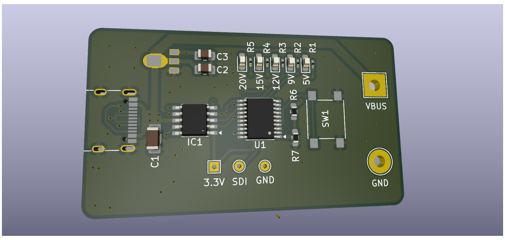

# Smart USB-C Power Delivery (PD) Trigger Board

A compact, low-cost USB-C Power Delivery decoy and utility bench tool. This project allows you to cycle through standard USB-PD profiles (5V, 9V, 12V, 15V, and 20V) at the push of a single button using a standard USB-C wall adapter or power bank.

Unlike basic decoy boards, this design features an active closed-loop feedback mechanism to monitor the actual voltage output, ensuring the status indicators always display accurate readings even if a charger has limited power profiles.

## Features

- **Single-Button Cycling:** Effortlessly step through 5V, 9V, 12V, 15V, and 20V target profiles using a single debounced tactile switch.
- **Closed-Loop LED Feedback:** An internal ADC reads the negotiated voltage through a resistor divider. The corresponding LED illuminates based on the *actual* output voltage, preventing false indicators if a charger defaults to a lower fallback voltage.
- **Ultra Low-Cost Architecture:** Built using the 32-bit RISC-V CH32V003 microcontroller and a dedicated WCH CH224K USB-PD sink controller.
- **Hardware Protection:** Equipped with a wide-input linear regulator (LDO) rated up to 30V to safeguard logic components against high-voltage transients during 20V switching.

## Hardware Specifications

- **Microcontroller:** WCH CH32V003F4P6 (TSSOP-20)
- **PD Controller:** WCH CH224K (ESSOP-10)
- **LDO Regulator:** Holtek HT7533-1 (SOT-89, 30V Max Input, 3.3V Output)
- **Voltage Sensing:** 100kΩ / 15kΩ resistor divider routed to ADC Channel 7 (`PD4`)
- **Programming Interface:** 1-Wire Serial Debug Interface (SDI) breakout header for WCH-LinkE

## Repository Structure

- `/firmware` : C source code matching standard peripheral libraries (MounRiver Studio / PlatformIO).
- `/hardware` : KiCad schematic and PCB layout design files.

- 
